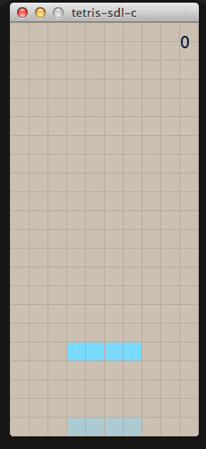

# Tetris SLD2 WiiU Port

Tetris for the WiiU !!!  

Original SDL code (Thanks for releasing the code):  
https://github.com/dashed/tetris-sdl-c  

## Future of this repo
Wiil be nice if I add sound, that will be a good way to improve the game and for me to learn more SDL2.

## Special Thanks

* [rw-r-r-0644](https://github.com/rw-r-r-0644) for it's help and guidance in moments when nothing wanted to compile and link correctly. 
* [yawut](https://github.com/yawut) Team for SDL port to the WiiU and wonderful tools.   
* [devkitpro Team](https://devkitpro.org/)
* All the people team the made homebrew possible on the wiiU

## Building instructions

I recomend a Linux Debian like operational system for better tools compatibility:
* Install [devkitpro](https://devkitpro.org/wiki/Getting_Started#Unix-like_platforms)
* Install [wiiu-fling](https://gitlab.com/QuarkTheAwesome/wiiu-fling)
* On a terminal install needed libraries:  
  `sudo dkp-pacman -Syu wiiu-libromfs wiiu-sdl2 wiiu-sdl2_gfx wiiu-sdl2_image wiiu-sdl2_mixer wiiu-sdl2_ttf`
* Clone this repo:  
  `git clone https://github.com/ulquiorra-dev/SDL_TETRIS_WiiU_Port.git`

* `cd Simple_SDL_Snake_WiiU_Port`
* `make`
* Enjoy ;)
